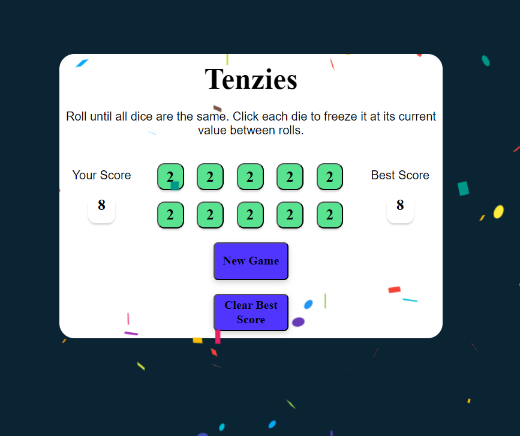

# Name of the Game: Tenzies
About the Game: Roll until all 10 dice are the same. Click each die to freeze it at its current value between rolls. Objective is to complete in minimum number of rolls.

# Steps to launch the application(assuming node is already installed):
1. Download the folder and in command prompt traverse to the root folder 'tenvite'
2. Install vite if not already
    npm install -g vite
3. Run the following command:
    npm install
    npm run dev

# React + Vite

This template provides a minimal setup to get React working in Vite with HMR and some ESLint rules.

Currently, two official plugins are available:

- [@vitejs/plugin-react](https://github.com/vitejs/vite-plugin-react/blob/main/packages/plugin-react/README.md) uses [Babel](https://babeljs.io/) for Fast Refresh
- [@vitejs/plugin-react-swc](https://github.com/vitejs/vite-plugin-react-swc) uses [SWC](https://swc.rs/) for Fast Refresh
